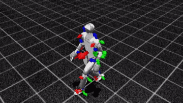
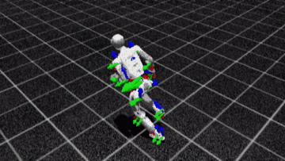
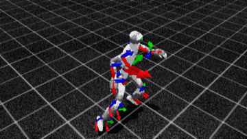
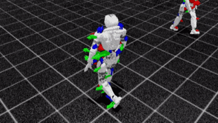
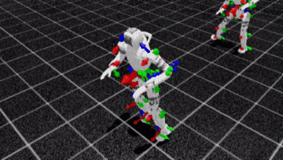

# mimic-results

人形机器人动作跟踪（motion tracking）复现与跨机器人移植：从人体动捕数据到仿真里的跟踪策略，再到 MuJoCo 中的 sim2sim 验证。

> **本仓库只展示部分成果（图、曲线、指标）。代码正在整理中，之后会补充上来。**
> 重定向后的动作数据和训练出的策略文件暂不公开，原因见文末「数据许可」一节。

## 做了什么

1. **复现 BeyondMimic 的动作跟踪部分（Unitree G1）。** 在 Isaac Lab 里用 PPO 训练了三条 LAFAN1 动作：走路、冲刺、搏击。
2. **把整条链路移植到智元 X2。** X2 没有现成的重定向数据，因此从人体动捕数据开始重做整条链路：
   用 GMR 做重定向，写格式转换和数据验收，接着做 FK 与重采样，然后训练，最后在 MuJoCo 里做 sim2sim。
3. **诊断 X2 为什么跟得比 G1 差。** 用控制变量实验，把差距拆成「重定向流程」和「机器人本身」两部分，并排除了几个候选原因。

## 数据链路

```
LAFAN1 人体动捕 (.bvh, 30 fps)
  └─ GMR 重定向（IK）──▶ X2 关节角
       └─ 格式转换：按关节名重排 ──▶ 36 列 CSV（根位置 3 + 根四元数 4 + 关节角 29）
            └─ 数据验收：帧号对齐 / 关节越限 / 离地高度 ──▶ 整段竖直平移
                 └─ FK + 30→50 Hz 重采样 ──▶ 训练用参考动作
                      └─ PPO 跟踪训练（Isaac Lab）──▶ 导出 ONNX
                           └─ MuJoCo sim2sim
```

## 主要工作

### 移植到 X2 时解决的问题

- **关节运动学差异。** 两台机器人的 29 个关节名字完全相同，但运动学不同：肘关节零点差约 90°、正方向相反，末端链接也不一样。
  G1 的关节角直接喂给 X2，姿态是错的，所以必须从人体数据重新重定向。
- **重定向的旋转偏置。** GMR 的 X2 配置沿用 G1 时，髋部带进约 21° 的偏差，肘和手带进约 91° 的偏差。修正后，走路动作的关节越限为 0 / 29。
- **仿真稳定性。** 碰撞体配置导致训练初期回合极短。修正碰撞体和出生高度后，冒烟训练里的平均回合长度从约 7 步提高到约 49 步。
- **物理可行性筛选。** 用弹道检验否掉了一条跳跃动作：机器人腾空时，竖直加速度应接近 −9.81 m/s²，重定向结果只有 −3.5 ～ −8。
  这说明重定向只保证姿态像，不保证动力学可行。

### sim2sim 验证（MuJoCo）

- X2 走路策略跑满 1000 / 1000 步，Mac 与 Ubuntu 两台机器上结果逐位一致。
- 两组反向对照都会摔倒：零动作 0.84 秒摔倒，关节顺序错位 0.42 秒摔倒。说明这个验证能区分对错，不是怎么跑都能过。

### X2 与 G1 的差距拆解（搏击动作，同一帧段）

跟踪误差 `error_anchor_pos`，取第 2800 ～ 2999 轮窗口均值：

| 配置 | 值 |
|---|---|
| G1 + 官方重定向数据 | 0.655 |
| G1 + GMR 重定向 | 0.834 |
| X2 + GMR 重定向 | 1.291 |
| X2 + GMR，关节速度上限 11.94 → 20 | 1.269 |

- 总差距里，换重定向流程占约 28%，换机器人占约 72%。
- 放开关节速度上限后几乎没有变化，因此排除了速度上限这个原因。
- 剩下的差距分成两部分：一部分是关节层约 1.4 倍的误差，走路和搏击上都有；另一部分是全局位置误差，只在快动作中出现。这两部分的原因仍在排查。

## 成果展示

Isaac Lab 中的策略回放，每段截取前 6 秒。

**Unitree G1**（复现）

| 走路 | 冲刺 | 搏击 |
|---|---|---|
|  |  |  |

**智元 X2**（移植）

| 走路 | 搏击 |
|---|---|
|  |  |

MuJoCo sim2sim 的视频之后补充。

## 使用的开源工作

- [BeyondMimic](https://arxiv.org/abs/2508.08241)：动作跟踪训练框架（[whole_body_tracking](https://github.com/HybridRobotics/whole_body_tracking)）
- [GMR](https://github.com/YanjieZe/GMR)：通用动作重定向
- [Isaac Lab](https://github.com/isaac-sim/IsaacLab)、[MuJoCo](https://github.com/google-deepmind/mujoco)

## 数据许可

动作数据来自 [Ubisoft La Forge Animation Dataset (LAFAN1)](https://github.com/ubisoft/ubisoft-laforge-animation-dataset)，
出自 Harvey 等人的 *Robust Motion In-betweening*（SIGGRAPH 2020），许可证为 CC BY-NC-ND 4.0。

该许可证不允许分发改编作品。重定向后的动作数据，以及内嵌了参考动作的策略文件，都属于改编作品，因此本仓库不包含这两类文件。
