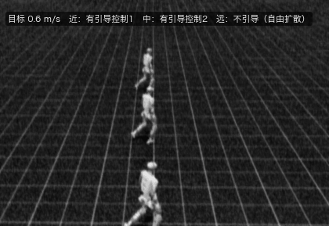
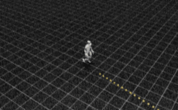
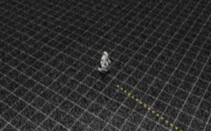
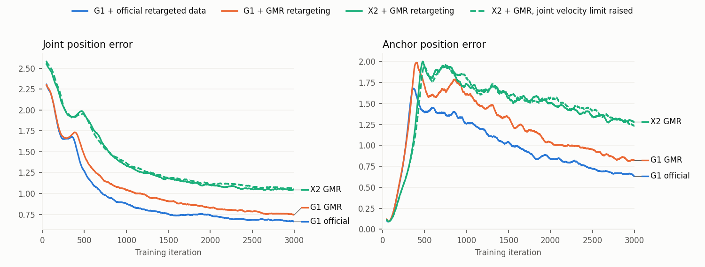
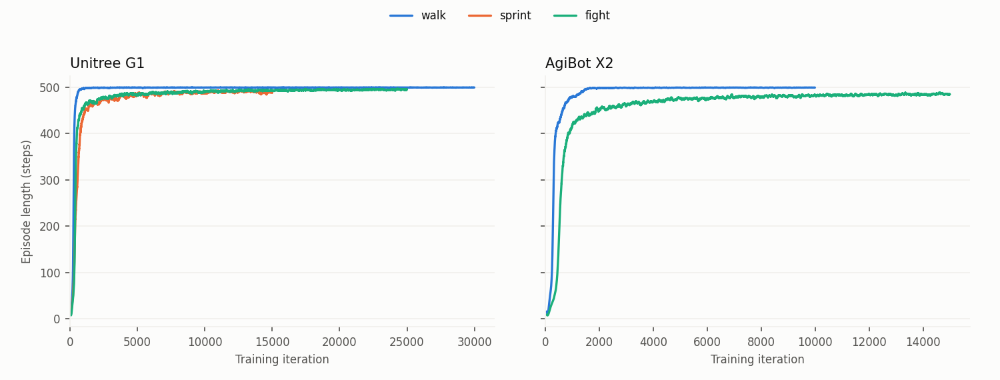
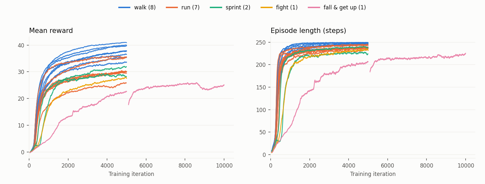

# mimic-results

人形机器人，beyondmimic复现记录（已包括扩散模型控制）。

## 做了些什么

先在 Unitree G1 上复现了 BeyondMimic 的动作跟踪部分，训了走路、冲刺、搏击三段动作。

然后把整套流程搬到了智元 X2 上。X2 没有现成可用的动作数据，所以自己做了一遍重定向。这一步有小坑：两台机器人的关节名字一样，但零点和方向不一样，直接套用 G1 的数据姿态是错的。重定向配置里也有几处角度偏差，要找出来修掉。关节的力矩和速度上限照 X2 官方 URDF 填。电机的转子惯量（armature）官方没给，就按力矩档位借用了 G1 同档电机的值，PD 增益再按 BeyondMimic 的公式从它算出来。这是个近似，估计也是 X2 跟不上 G1 的候选原因之一。

训好的 X2 策略又放到 MuJoCo 里做了 sim2sim，能稳定走完。

之后复现了 BeyondMimic 的扩散模型部分，这部分代码截至目前原作者没有开源。先按原论文减量实现：19 段动作各训一个跟踪策略，加镜像共 38 段；蒸馏成一个"编–解码器"；在状态和潜变量上训练扩散模型；推理时由扩散模型在仿真里闭环控制。也按论文实现了速度引导。然后，在此基础上做了一些自己的小改进，最终的效果如图，个人觉得在原文的基础上继续研究，仍有很多有意思的东西。

全部工作在一张 RTX 5070 Ti（16 GB）上完成，一个完整训练周期其实不短，也因此数据量和训练量都约为原文的十分之一：动作数据约 16 分钟（原文约 2.5 小时），扩散模型训练 100 个 epoch（原文 1000 个）等。但已有不错效果。

## 流程

```
人体动捕 (.bvh)
  → 重定向到机器人关节角
  → 转成训练要的格式，检查越限和离地
  → 正运动学 + 重采样
  → PPO 训练（Isaac Lab）
  → 导出 ONNX，在 MuJoCo 里验证
```

## 效果

### 动作跟踪

Isaac Lab 里的回放。

**Unitree G1**

| 走路                           | 冲刺                             | 搏击                            |
| ---------------------------- | ------------------------------ | ----------------------------- |
|  |  |  |

**智元 X2**

| 走路                           | 搏击                            |
| ---------------------------- | ----------------------------- |
|  |  |

### 扩散模型

三台放一块，同一个起点，自由扩散和加引导扩散的对比。



- 离镜头最近（画面最下方）的是有引导控制1，中间的是有引导控制2，最远（画面最上方）的不加引导（自由扩散）。

### 引导扩散的复杂路径效果

确实很容易被“历史运动的模式”困住。

 

## 训练曲线

两台机器人跟同一段搏击动作。X2 的误差一直比 G1 高，放开关节速度上限（虚线）以后也几乎没变化。（锚点误差开头很低，是因为那时机器人很快就摔了，还没来得及跑偏。）

<picture>
  <source media="(prefers-color-scheme: dark)" srcset="media/gap_dark.png">
  
</picture>

五个策略的训练过程。纵轴是机器人每回合能坚持多少步不摔。

<picture>
  <source media="(prefers-color-scheme: dark)" srcset="media/train_dark.png">
  
</picture>

扩散用到的 19 个"教师"模型大多训了 5000 轮（跌倒起身续训到 10000 轮）。从曲线看，5000 轮时回合长度已经基本到顶，奖励还在缓慢上升。前面动作跟踪的策略训过 30000 轮，对多数复现和改进来说差别不大。

<picture>
  <source media="(prefers-color-scheme: dark)" srcset="media/teachers_dark.png">
  
</picture>

## 用到的项目和工具

[BeyondMimic](https://github.com/HybridRobotics/whole_body_tracking)、[GMR](https://github.com/YanjieZe/GMR)、[Isaac Lab](https://github.com/isaac-sim/IsaacLab)、[MuJoCo 等](https://github.com/google-deepmind/mujoco)

训练记录和上面的曲线用的是 [Weights & Biases](https://wandb.ai)，参考动作也存在它的注册表里。

## 关于数据

动作数据来自 Ubisoft 的 [LAFAN1](https://github.com/ubisoft/ubisoft-laforge-animation-dataset)，许可证是 CC BY-NC-ND 4.0，不允许分发改编后的版本。所以重定向后的数据和训出来的模型文件都不放在这里。


